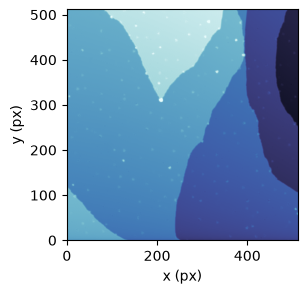
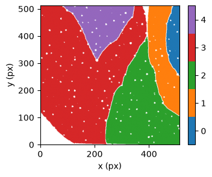
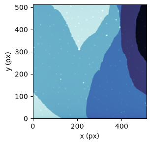
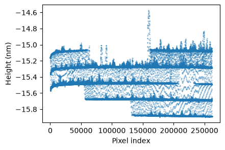
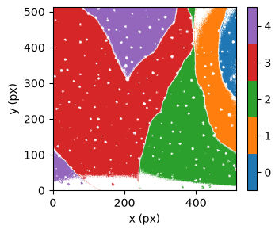
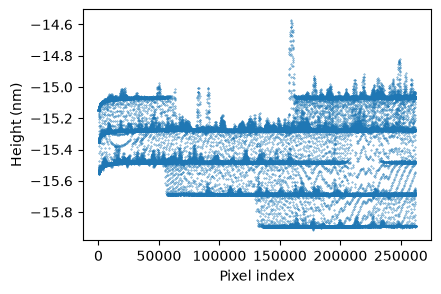
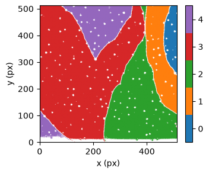
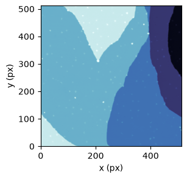
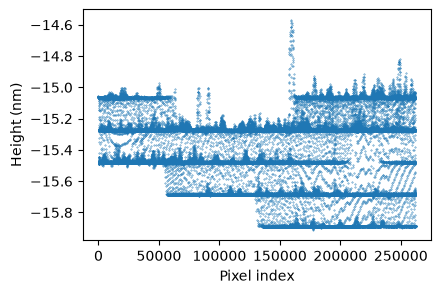
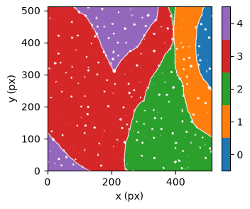

Examples
========

Here, we demonstrate how to use the software with the dataset shown below, which was also analyzed in `the original paper <https://doi.org/10.1063/5.0038852>`_.
We assume that the data are provided as a NumPy array.

Guess initial responsibility
----------------------------
As with many other fitting procedures, initial values must first be specified.
In sati, they are provided as responsibilities.

.. code-block:: python

  import sati

  n_terraces = 5
  rsp = sati.Responsibility(image, n=n_terraces)
  rsp.initial_guess(tolerance=1e-2)

``initial_guess`` creates an initial soft assignment (responsibility) for each pixel and class.
Internally, it groups neighboring pixels with similar heights and then assigns those groups to the ``n`` terrace classes.

The ``tolerance`` argument controls the criterion used to determine whether neighboring pixels belong to the same terrace.
Smaller values impose a stricter criterion, so only pixels with more similar heights are grouped together, whereas larger values allow greater height differences within the same terrace.

The resulting initial responsibility map can be viewed as follows.
Here, ``classify`` is used to convert the responsibility map into a class-label image for visualization.

.. code-block:: python

  import matplotlib.pyplot as plt
  from matplotlib.colors import ListedColormap

  rspargs = dict(
      origin="lower",
      cmap=ListedColormap(plt.colormaps["tab10"].colors[:n_terraces]),
      vmin=-0.5,
      vmax=n_terraces - 0.5,
  )

  fig, ax = plt.subplots()
  im = ax.imshow(rsp.classify(1), **rspargs)
  ax.set_xlabel("x (px)")
  ax.set_ylabel("y (px)")
  fig.colorbar(im, ax=ax)
  plt.show()

White pixels indicate pixels for which no initial responsibility has been assigned.
Such unassigned pixels do not cause a problem.
For example, when two spatially disconnected terraces are expected to have the same height, as in this example, it is sufficient to assign an initial responsibility to only one of them and leave the other unassigned.

Subtract a polynomial plane
---------------------------
Using the initial responsibilities obtained above, the image can be analyzed with a linear background plane and a Cauchy distribution as follows.

.. code-block:: python

  m = sati.Model(
    image,
    rsp=rsp,
    poly=sati.planes.Poly(),
    dist=sati.distributions.Cauchy(),
  )
  m.optimize()

After optimization, the estimated quantities are available through the following attributes:

* ``m.subtracted`` is the image after subtraction of the fitted plane.
* ``m.rsp`` contains the estimated responsibilities, representing a soft assignment of each pixel to a terrace class.
* ``m.dist.loc`` contains the estimated location parameters of the distribution, corresponding to the terrace heights.
* ``m.dist.scale`` contains the estimated scale parameters of the distribution, characterizing the height variation within each terrace.

The image after subtracting the linear plane is shown below.

.. code-block:: python

  fig, ax = plt.subplots()
  im = ax.imshow(m.subtracted, origin="lower")
  ax.set_xlabel("x (px)")
  ax.set_ylabel("y (px)")
  plt.show()

The quality of the fit can be assessed, for example, by plotting the subtracted image after flattening it into one dimension.
In this example, the effect of creep is visible near the left edge, and the terraces still exhibit slight curvature.

.. code-block:: python

  fig, ax = plt.subplots()
  ax.scatter(np.arange(image.size), m.subtracted.ravel())
  ax.set_xlabel("Pixel index")
  ax.set_ylabel("Height (nm)")
  plt.show()

The quality of the fit can also be assessed by examining the estimated responsibilities.
``m.rsp.classify(0.99)`` assigns each pixel the index of the class with the largest responsibility if that responsibility is at least 0.99; otherwise, it returns ``NaN``.
The region near the bottom edge of the image has low maximum responsibilities, indicating that the effect of creep has not been fully removed.
There is also a region with low maximum responsibilities near the upper-right corner of the image.

.. code-block:: python

  fig, ax = plt.subplots()
  im = ax.imshow(rsp.classify(0.99), **rspargs)
  ax.set_xlabel("x (px)")
  ax.set_ylabel("y (px)")
  fig.colorbar(im, ax=ax)
  plt.show()

Increasing the order of the polynomial can improve the fit.
In the following example, the results of the first-order fit above are used as the initial values for fitting a second-order surface.

.. code-block:: python

  m.poly = sati.planes.Poly(degree=2, coef=m.poly.coef)
  m.optimize()

Evaluating the fit in the same manner as above shows that the result has improved.
In the one-dimensional plot, the curvature of each terrace has been largely removed, and the white region in the upper-right corner has disappeared from the responsibility map.
However, the effect of creep remains.
As described in the next section, it can be removed by fitting a decay term that depends on the data acquisition order.

Subtract decays
---------------
To fit a decay term that depends on the data acquisition order, proceed as follows.

.. code-block:: python

  m.decay=sati.planes.Decay(tau=500, coef=-0.02, orgdrct="lbx"),
  m.optimize()

In this example, a logarithmic decay term is added and optimized using the results of the second-order surface fit as the initial values.
Alternatively, the entire optimization can be performed in a single step from the initial responsibilities, as shown below.

.. code-block:: python

  m = sati.Model(
      image,
      rsp=rsp,
      poly=sati.planes.Poly(degree=2),
      decay=sati.planes.Decay(tau=8000, coef=-0.02, orgdrct="lbx"),
      dist=sati.distributions.Cauchy(),
  )
  m.optimize()

The units of ``tau`` and ``coef`` are pixels and the unit of the height (e.g. nm), respectively.
The original image was acquired starting from the lower-left corner, with the `x` direction as the fast-scan direction. This acquisition order is specified by ``orgdrct="lbx"``.

The optimized result below shows that the effect of creep has been removed.

.. _estimating-unitheight:

Estimate the unit step height
-----------------------------
The unit step height can be estimated by applying a von Mises prior to the location parameters of the model distribution.

.. code-block:: python

  c0, mu0 = np.polyfit(np.arange(n_terraces), m.dist.loc, 1)
  m.prior = sati.distributions.VonMises(scale=c0, kappa=[0.1]*n_terraces, loc=2*np.pi*mu0/c0)
  m.optimize()

The ``scale`` parameter specifies an initial guess for the unit step height.
After optimization, the estimated value is stored in the ``scale`` attribute (``m.prior.scale`` in the example above).
The length of ``kappa`` must match the number of terrace classes.
